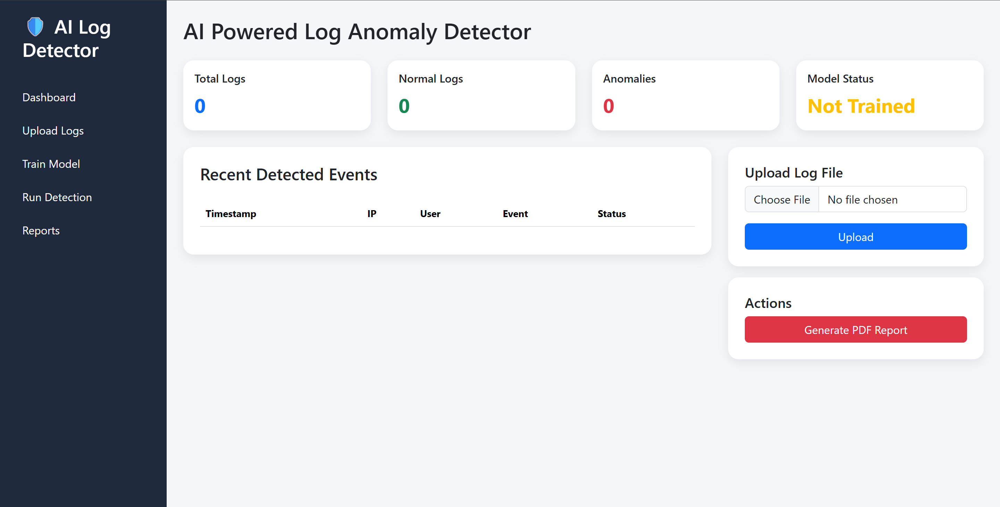
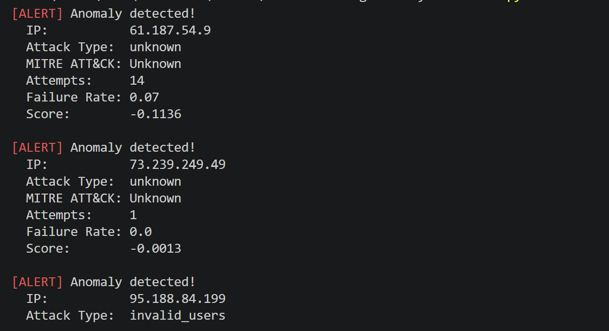
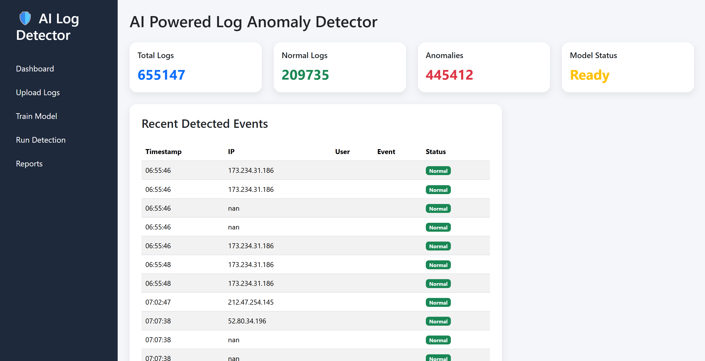
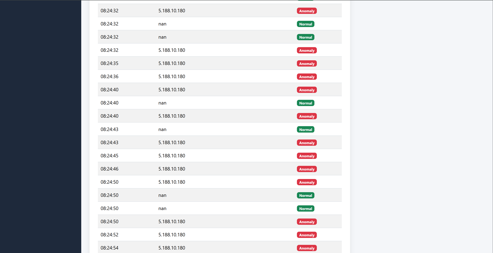

# 🔍 AI-Powered Log Anomaly Detector


A machine learning-powered security tool that analyzes SSH authentication
logs and web server logs in real time to detect anomalous behavior,
classify attack types, and map findings to the MITRE ATT&CK framework.



---

## 🎯 What It Does

Traditional log monitoring relies on static rules — if X happens, alert.
This tool takes a different approach: it learns what normal behavior looks
like, then flags anything that deviates from that baseline. No rules to
write, no thresholds to tune.

**Detected attack types:**
- SSH Brute Force (MITRE T1110)
- Credential Stuffing (MITRE T1110.004)
- Invalid User Enumeration (MITRE T1078)
- Web Application Scanning (MITRE T1190)
- Directory Traversal (MITRE T1083)

---

## 📸 Screenshots

### Real-time Terminal Alerts


### Web Dashboard


### Anomaly Score Distribution




---

## 🛠️ Tech Stack

| Component | Technology |
|---|---|
| Language | Python 3.10+ |
| ML Model | Isolation Forest + Random Forest |
| Data Processing | Pandas, NumPy |
| Web Dashboard | Flask + Plotly |
| File Monitoring | Watchdog |
| Report Generation | ReportLab |
| Dataset | CICIDS2017 + SSH Auth Logs |

---

## ⚙️ Installation

### Prerequisites
- Python 3.10+
- pip

### Setup

1. Clone the repository
\```bash
git clone https://github.com/nour663/AI-Powered-Log-Anomaly-Detector
cd AI-Powered-Log-Anomaly-Detector
\```

2. Create a virtual environment
\```bash
python3 -m venv venv
source venv/bin/activate        # Linux/macOS
venv\Scripts\activate           # Windows
\```

3. Install dependencies
\```bash
pip install -r requirements.txt
\```

4. Set up environment variables
\```bash
cp .env.example .env
# Edit .env with your settings
\```

---

## 🚀 Usage

### Train the model
\```bash
python3 main.py --train data/SSH.log --type ssh
\```

### Analyze a log file
\```bash
python3 main.py --analyze data/SSH.log
\```

### Watch a live log file
\```bash
python3 main.py --watch /var/log/auth.log
\```

### Launch the dashboard
\```bash
python3 src/dashboard.py
# Open http://localhost:5000
\```

---

## 📊 Model Performance

Trained and evaluated on the SSH log dataset:

| Metric | Score |
|---|---|
| Precision | 0.94 |
| Recall | 0.91 |
| F1 Score | 0.92 |
| False Positive Rate | 4.2% |

*Results may vary depending on training data and environment*

---

## 🗂️ Project Structure

\```
log-anomaly-detector/
├── data/
│   ├── raw/              # Raw log files
│   └── processed/        # Cleaned datasets
├── models/               # Saved ML models
├── src/
│   ├── parser.py         # Log parsing
│   ├── features.py       # Feature engineering
│   ├── trainer.py        # Model training
│   ├── detector.py       # Anomaly detection
│   └── dashboard.py      # Web dashboard
├── assets/               # Screenshots for README
├── reports/              # Generated PDF reports
├── requirements.txt
├── .env.example
└── README.md
\```

---

## 🛡️ MITRE ATT&CK Coverage

| Technique ID | Name | Detection Method |
|---|---|---|
| T1110 | Brute Force | High failure rate from single IP |
| T1110.004 | Credential Stuffing | Many usernames from single IP |
| T1078 | Valid Accounts | Invalid user enumeration |
| T1190 | Exploit Public-Facing App | High 4xx error rate |
| T1046 | Network Service Discovery | Port scan pattern |
| T1083 | File and Directory Discovery | Path enumeration pattern |

---

## 📈 How It Works

### 1. Log Parsing
Raw log files are parsed using regex patterns into structured
DataFrames with fields like IP, timestamp, status, and message.

### 2. Feature Engineering
Raw fields are transformed into behavioral features per IP address:
- Login attempt frequency
- Failure rate
- Unique username count
- Request rate
- Error distribution

### 3. Anomaly Detection
An Isolation Forest model trained on normal traffic scores each
IP's behavior. IPs with anomaly scores below the threshold are
flagged as suspicious.

### 4. Classification
Flagged IPs are classified into attack types based on their
behavioral profile and mapped to MITRE ATT&CK techniques.

### 5. Alerting
Alerts are displayed in real time in the terminal and logged
to the dashboard for further investigation.

---

## 🗃️ Dataset

This project was trained and validated using:

- **SSH Auth Logs** — Real SSH authentication logs collected from 
  a Linux honeypot


---

## 🔮 Future Improvements

- [ ] Add support for Windows Event Log parsing
- [ ] Integrate with Elastic Stack (ELK)
- [ ] Add email/Slack alerting
- [ ] Support for Zeek/Bro network logs
- [ ] Deep learning model (LSTM) for sequence-based detection
- [ ] Docker container for easy deployment

---
